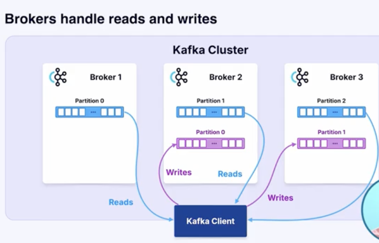
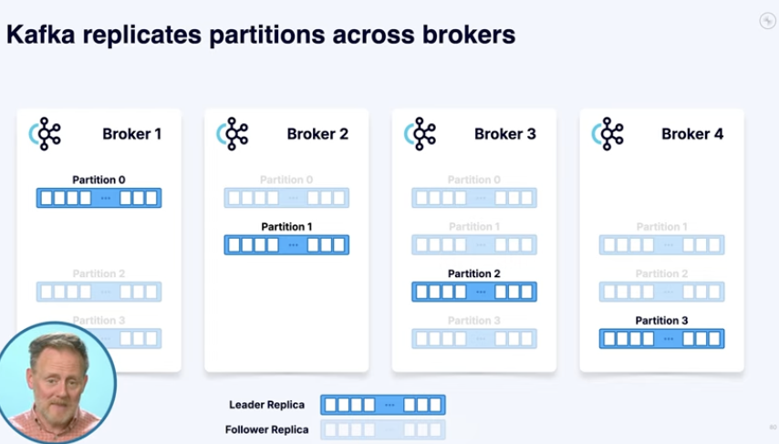

## key learnings 
# Kafka
  ## Kafka broker: 
  
    {

    Initial thoughts: a broker is like a k8s node that runs a kafka service
    
    Revised thought: A broker is is a core server in an kafka cluster, that dose the collection, processing and partitioning of dat, it acts as a consumer and producer endpoint to accept data and send data to sources, it also helps data replication trought partitions and topics

     }
    


  ## kafka topics
    
    
        Kafka topics are immutable logs, meaning once wrriten they cannot be change, that allows you to store, strem processes sequence of events, relaibale, with full historical context, every kafa topic consist of a message that keeps getting appended, ech message contains key, value and timestamp, timestamp of when the event was created, key: an Id of the message, and value = the message

  ## topic partitions


    Partitions are what make kafa scalable relaiable and efficient, with kafka 4.0 you cn scale up to 2 million partitions, this also means you are not gurranted of global odering, kafka(KRaft) uses a hash funtion with your message key to assain a log to a partition, if the log has no key it assigns it using round-robin.
  

  ## Replications

  

  

    Replication is used to ensure fault tolerance and load balancing in kafka, every partition can be specifed a replica, for example lets say 3, one of the replica amongs the 3 will be choosen as the lead replica, the rest remains as followers, if do any reason there is a data loss and the lead replica goes down data can be backed up by the floowers and one of them assumes the status of lead replica, by default you always write and read data from the lead replicas, but in soe cases maybe due to latency you can read from a follower replica that is closes to you.
  


## Async and Sync Sending:
 Producers can send messages either asynchronously or synchronously. Asynchronous sending allows the producer to continue processing without waiting for a response from the broker, providing high throughput. Synchronous sending waits for acknowledgment from the broker before continuing, ensuring reliable delivery but potentially impacting performance.

## Message Compression: 

Producers can enable compression for messages to reduce network bandwidth and storage costs. Kafka supports different compression codecs such as gzip, snappy, and lz4.

## Retries and Error Handling: 

Producers handle failures and errors by implementing configurable retries and error handling mechanisms. When a message fails to be delivered, producers can retry sending the message based on specified configuration settings.

- Retry Policy
- Exponential Backoff
- Dead-Letter Queue

## Message Key and Value Serialization: 

Producers serialize the key and value of a message before sending them to Kafka. Serialization allows messages to be converted into byte arrays that can be efficiently transmitted and stored.


  - Topic replicas {For HA minmum of 2 replica}
  - consumers and producers
  - kafka brokers and client telemetry
  - SCRAM Authenticatiion
```
observerbility = telemetry + Visualization
```
- Golang
  - undersand what is going on in the struct folder 
  - pkg vs internal what does that mean, why is it named that way?
  - multi process vs multi-threading
- HTTP RestAPI