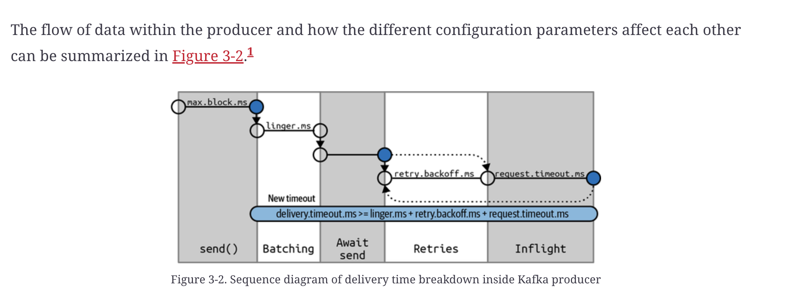

## Configuring producers

`ack`

The ack parameter controls how many partitions replica must recive an event before it can consider the write sucessful, by default it consider a write sucsessful once the leader acknowledges a message. it has 3 modes `ack=0` this meas dont wait for broker to acknowledge message before sending next message. the implication of this iis that is a message dosent get delivered the producer will not be made aware.
`ack=1` the producer shall recive a message from the broker once the leader recives a message, if for some reason the leader crashes the producer will recive a message and retry sending the message.
`ack=all` this is the safest mode the leader shall recive a sucess responce once all sync replicas recives a message, this way even if one broker crashes there is certainty that the message is replicated in other brokers. although this increases the latency.

`Message Delivery Time`

`max.block.ms`
this is the maximum ammount of time your producer can wait when it tries to send a message to kafka. there are may reasons why you could need this, to trigger when the memory buffer is fuul instead of dropping messages, it waits for the buffered memmory to clear out a bit, or inf the broker is not ready and it cant recive metadat such as topics, patitions, leaders etc, this time is how long the producer will wait for them to exist before it drops the message

`delivery.timeout.ms`

This is the ammount of time from when a mesage hits the send() call plus the ammount of retry etc, until the broker responds or the clieent gives up. If the producer exceeds delivery.timeout.ms while retrying, the callback will be called with the exception that corresponds to the error that the broker returned before retrying. 

You can configure the delivery timeout to the maximum time you’ll want to wait for a message to be sent, typically a few minutes, and then leave the default number of retries (virtually infinite). With this configuration, the producer will keep retrying for as long as it has time to keep trying (or until it succeeds). This is a much more reasonable way to think about retries

`request.timeout.ms`
This is how long the producer will wait for a reply from a broker when sending data. this doe snot include retries or time spent before ending.

`retries`
this parameter controls how many times the producer will send a message before giving up and notifing client of the issue

`retry.backoff.ms`
how long you wait between retries

`linger.ms`
how long you wait for additional message before sending a batch of messages

`buffer.memory`
the ammount of memmory the producer will use to puffer mesages before sending it to the broker.  If messages are sent by the application faster than they can be delivered to the server, the producer may run out of space, and additional send() calls will block for max.block.ms and wait for space to free up before throwing an exception. Note that unlike most producer exceptions, this timeout is thrown by send() and not by the resulting Future.

`compression.type`

parameter to compress message sizes, into `gzip`, `snappy`, `lz4`, `zstd` format, the compression algorithim will be used to used to compress the data befor sending it to the brokers

`batch.size`
this parameter controls the ammount of memory the messages in each batch can contain

`max.in.flight.requests.per.connection `

“In flight” = sent to the broker, but not yet acknowledged.

controls how many batches the producer can send without waiting for broker replies — higher improves throughput but increases memory use and can affect ordering if not configured carefully.

`max.request.size`

This setting controls the size of a produce request sent by the producer. It caps both the size of the largest message that can be sent and the number of messages that the producer can send in one request. For example, with a default maximum request size of 1 MB, the largest message you can send is 1 MB, or the producer can batch 1,024 messages of size 1 KB each into one reques

`receive.buffer.bytes and send.buffer.bytes`

These are the sizes of the TCP send and receive buffers used by the sockets when writing and reading data. If these are set to –1, the OS defaults will be used. It is a good idea to increase these when producers or consumers communicate with brokers in a different datacenter, because those network links typically have higher latency and lower bandwidth.

These settings control how much data Kafka can keep “on the wire” while waiting for network round trips — critical for high-latency links, irrelevant for fast local networks.

`enable.idempotence`

this criteria ensures that serial numbers are assigned to each batch, so order doesnt get mixed up, and ensure that messages are written at leat once, this `requires max.in.flight.requests.per.​con⁠nection `to be less than or equal to 5, `retries` to be greater than 0, and `acks=all`.